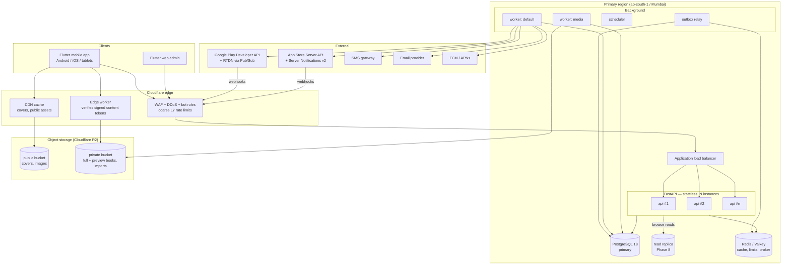

# 01 — System Architecture

Covers deliverables **A** (system architecture), **M** (load balancing), **N** (deployment) and the cross-cutting concerns: caching, background work, events, search, observability.

---

## 1. Architecture at a glance



**Style:** a **modular monolith**. One deployable FastAPI codebase is split into domain modules with enforced boundaries. The same container image runs as `api`, `worker`, `scheduler`, `relay` and `migrate`, each selected by its command. See [ADR-001](10-technology-decisions.md#adr-001--modular-monolith-not-microservices).

**State lives in exactly three places:** PostgreSQL (source of truth), Redis (ephemeral or derived state only), object storage (binary content). API processes hold no state that matters, so any instance can serve any request.

## 2. Backend module map

```text
backend/app/
├── core/            config, db sessions (read/write), redis, logging, telemetry, errors,
│                    response envelope, pagination, security primitives
├── platform/        audit, outbox/events, idempotency, storage (S3 API), media assets,
│                    search service, app settings, import framework
├── identity/        users, auth (password, OTP, OAuth), tokens, devices, roles, permissions
├── catalog/         books, editions, files, authors, publishers, categories, tags, rights, reviews
├── library/         reading progress, bookmarks, highlights, notes, shelves, collections, sync
├── access/          access-policy evaluation, content access, download grants, offline licences
├── commerce/        plans, products, store products, subscriptions, payments, entitlements, providers
├── academics/       curricula, education levels, boards, groups, subjects, chapters, topics
├── qbank/           stimuli, questions, options, parts, papers, revisions, reviews, saved, reports
├── assessment/      quizzes, selection rules, attempts, answers, scoring, results
├── analytics/       event ingestion, rollups, learner stats, dashboards, recommendations
├── notifications/   inbox, preferences, broadcasts, push adapters
├── admin/           admin routers composing module services (no business logic of its own)
└── ai/              empty boundary (later phases) — LLM/RAG integrations go here
```

Each domain module has the same internal shape:

```text
catalog/
├── api/            FastAPI routers (HTTP only: parse, authorise, call service, wrap envelope)
├── schemas/        Pydantic request/response models (the API contract)
├── services/       use cases, transactions, resource authorisation; emits domain events
├── repositories/   SQLAlchemy queries; the only layer that knows SQL
├── models/         SQLAlchemy ORM models
├── events.py       payload types of events this module publishes
└── tasks.py        background task handlers this module owns
```

**Dependency rules** (checked in CI with `import-linter`):

- `api → services → repositories → models`, never the reverse.
- Modules talk to each other only through another module's **public service interface** (`catalog/services/public.py`) or through **events**. A module never imports another module's repositories or models.
- `core` and `platform` depend on no domain module.
- `access` depends on `catalog` (rights, files) and `commerce` (entitlements). `commerce` does not depend on `access`.
- `admin` may depend on any module's services; nothing depends on `admin`.

This keeps an extraction path open. If `assessment` ever needs to scale on its own, it already talks to the rest through narrow interfaces and events.

## 3. Request lifecycle

```text
Client
 → Cloudflare (TLS, WAF, coarse rate limit, CF-Connecting-IP, CF-IPCountry)
 → Load balancer (health-checked targets, least outstanding requests)
 → Uvicorn worker
   → middleware: request id, trusted proxy headers, log context, OTel span,
                 security headers, body-size limit, CORS (admin origin only)
   → router: Pydantic validation of path / query / body
   → dependencies: current_principal (JWT verify), require_permission(...),
                   rate_limit(policy), WriteSession / ReadSession
   → service: business rules, resource-level authorisation, entitlement checks,
              one DB transaction; outbox rows written in the SAME transaction
   → response: envelope {data, meta, errors}; ETag / Cache-Control where cacheable
```

### Read/write split from day one

Two FastAPI dependencies exist from Phase 1:

- `WriteSession`: the primary. Used by every command and by any read that must observe its own writes (e.g. "my quiz attempt").
- `ReadSession`: used by catalogue and browse queries that tolerate small replication lag.

Both point to the primary until Phase 8. Introducing replicas is then a configuration change, not a refactor.

Replica reads are **never** used for authorisation decisions, entitlement checks, quiz attempts, sync pulls, or any read followed by a write.

## 4. Caching strategy

Redis is a cache and coordination store, **never the source of truth**. Every cached value can be rebuilt from PostgreSQL.

| What | Key | TTL | Invalidation | If Redis is down |
|------|-----|-----|-------------|------------------|
| Home sections (per locale, per level) | `home:v{n}:{locale}:{level}` | 5 min | `BOOK_PUBLISHED` / `QUIZ_PUBLISHED` bump `v{n}` | Compute from DB |
| Book detail (public part) | `book:{id}:{updated_at}` | 1 h | Key contains `updated_at` | DB |
| Category tree | `categories:tree:v{n}` | 24 h | Version bump on any category write | DB |
| Author / publisher summary | `author:{id}:{updated_at}` | 1 h | As book | DB |
| Curriculum taxonomy | `academics:tree:{curriculum_id}:v{n}` | 24 h | Version bump on write | DB |
| Quiz catalogue page | `quizzes:{filter_hash}:v{n}` | 5 min | Bump on quiz publish/unpublish | DB |
| Question browse page (published only) | `qb:{filter_hash}:{cursor}:v{n}` | 10 min | Bump per subject on question publish/archive | DB |
| User entitlement snapshot | `ent:{user_id}` | 60 s | Deleted on any entitlement change for that user | DB (authoritative) |
| Search suggestions | `suggest:{locale}:{prefix}` | 10 min | TTL only | Empty suggestions |

Patterns:

- **Versioned keys** instead of mass deletes. A small `cachever:{namespace}` counter is incremented on writes.
- **Stampede protection**: a single-flight lock (`SET NX PX`) per key during recompute; other callers serve stale-while-revalidate when available.
- **Per-user data never goes into shared keys.** Personalised home sections are a cached generic part plus a small per-user call.
- HTTP caching: public catalogue GETs return `ETag` + `Cache-Control: public, max-age=60`. Authenticated responses default to `private, no-store`.

## 5. Background work and events

### 5.1 Transactional outbox

Services never publish to the broker from inside a request. They insert an `outbox_events` row **in the same transaction** as the business change. The `relay` process:

1. Claims `outbox_events WHERE published_at IS NULL ORDER BY id LIMIT 500 FOR UPDATE SKIP LOCKED`.
2. Dispatches each event to its registered handlers as background tasks.
3. Sets `published_at`.

No lost events (the event commits with the data), no phantom events (a rollback leaves none). Delivery is at-least-once, so every handler is **idempotent**, keyed by `event_id`.

### 5.2 Queues

| Queue | Workers | Jobs |
|-------|---------|------|
| `default` | general | notifications, email, SMS, entitlement recompute, search indexing, cache invalidation, learner stats |
| `media` | high-memory, low concurrency | EPUB/PDF validation, metadata and text extraction, preview generation, cover variants, malware scan |
| `payments` | general; ordered per subscription via a per-subscription lock | provider verification, webhook processing, reconciliation |
| `imports` | general | CSV/XLSX imports, processed in chunks |
| `analytics` | general | batch inserts from the stream, rollups |

Scheduled jobs (`scheduler`, single leader via a Redis lock): quiz attempt expiry sweep (30 s), subscription reconciliation (hourly for due items, full daily), analytics rollups (15 min intraday + nightly final), idempotency-key cleanup, expired grant cleanup, monthly partition creation, token cleanup.

### 5.3 Domain event catalogue

| Event | Producer | Consumers |
|-------|----------|-----------|
| `USER_REGISTERED` | identity | notifications (welcome), analytics |
| `USER_DELETION_REQUESTED` | identity | every module (delete / anonymise own data) |
| `BOOK_UPLOADED` | catalog | media pipeline (validate, extract, preview, cover variants) |
| `BOOK_PROCESSED` | media | catalog (file ready), admin notification |
| `BOOK_PUBLISHED` / `BOOK_UNPUBLISHED` | catalog | search index, cache, notifications, access (licence revocation on takedown) |
| `BOOK_ACCESS_CHANGED` | catalog | cache, search filters |
| `BOOK_STARTED` / `BOOK_FINISHED` | library | analytics, recommendations |
| `DOWNLOAD_STARTED` / `DOWNLOAD_COMPLETED` | access | analytics, abuse detection |
| `SUBSCRIPTION_CREATED` / `_RENEWED` / `_IN_GRACE` / `_ON_HOLD` / `_CANCELLED` / `_EXPIRED` / `_REVOKED` | commerce | entitlement recompute, notifications, analytics |
| `ENTITLEMENT_CHANGED` | commerce | cache invalidation, access (licence revocation when access is lost) |
| `QUESTION_PUBLISHED` / `QUESTION_ARCHIVED` | qbank | search index, quiz pool cache |
| `QUESTION_BOOKMARKED` | qbank | analytics |
| `QUIZ_PUBLISHED` | assessment | notifications, cache |
| `QUIZ_STARTED` / `QUIZ_COMPLETED` / `EXAM_COMPLETED` | assessment | learner stats, analytics, recommendations |
| `NOTE_CREATED` | library | analytics |
| `IMPORT_COMPLETED` | platform | notify uploader |

High-volume product analytics (screen views, page turns) bypass the outbox and go to the ingestion endpoint ([§7](#7-analytics-pipeline)).

## 6. Content storage and delivery

```text
PostgreSQL (metadata)                Object storage (R2)
  book_files: storage_key,       →   private: books/{edition_id}/{file_id}/full.epub
  sha256, size, status                        books/{edition_id}/{file_id}/preview.epub
                                              imports/{job_id}/source.xlsx
                                              quarantine/{upload_id}
  media_assets                   →   public:  covers/{asset_id}/{variant}.webp
                                              content/{asset_id}/{variant}.webp
```

- **Public bucket** sits behind the CDN on a custom domain with long `immutable` cache headers. Keys contain the asset id, so nothing ever needs purging.
- **Private bucket** has no public access. Delivery ([ADR-007](10-technology-decisions.md#adr-007--protected-content-delivery-edge-worker-with-hmac-tokens)):
  1. **Default:** an **edge worker** on the content domain validates a short-lived HMAC token (`file_id`, `user_id`, `device_id`, `grant_id`, `exp`) minted by the API, then streams the object from an R2 binding with HTTP range support. Authorisation happens per request and large files never pass through FastAPI.
  2. **Fallback:** a SigV4 presigned GET (≤ 5 min) against the R2 S3 endpoint.
- Admin uploads use **presigned multipart PUT** into `quarantine/`. A media worker validates and promotes them ([05 §6](05-security-architecture.md#6-file-upload-security)).

The full access flow is in [06 §3](06-reader-and-offline-sync.md#3-secure-access-and-download-flow).

## 7. Analytics pipeline

```text
Client batches events (≤ 50, every 30 s or when backgrounded)
 → POST /api/v1/analytics/events (rate-limited, schema-validated, batch_id idempotent)
 → XADD to Redis Stream analytics:ingest   (API answers 202 immediately)
 → analytics worker: XREADGROUP → COPY into analytics_events (monthly partitions)
 → rollup jobs → user_daily_activity, daily_metrics
 → dashboards read rollups + transactional tables, never raw events at request time
```

Learner skill statistics are updated from `QUIZ_COMPLETED` events (transactional facts), not from client analytics. If raw volume outgrows PostgreSQL (≈ 50M+ events/month), the stream consumer gains a warehouse sink (ClickHouse / BigQuery) with no client change.

## 8. Search architecture

Search sits behind a `SearchService` protocol in `platform`:

```python
class SearchService(Protocol):
    async def search_books(self, query: BookSearchQuery) -> SearchPage[BookHit]: ...
    async def search_questions(self, query: QuestionSearchQuery) -> SearchPage[QuestionHit]: ...
    async def suggest(self, prefix: str, locale: Locale) -> list[Suggestion]: ...
    async def upsert(self, doc: SearchDocument) -> None: ...
    async def remove(self, entity_type: EntityType, entity_id: UUID) -> None: ...
```

| Version | Implementation | When to move on |
|---------|----------------|-----------------|
| **V1 (Phase 2)** | PostgreSQL: denormalised `search_documents` maintained by indexing jobs. Weighted `tsvector` using the `simple` configuration (no English stemmer mangling Bangla) plus an `english` vector for English text. `pg_trgm` for typo tolerance and prefix suggestions. NFC normalisation and Bangla digit folding (০–৯ → 0–9) at index and query time | p95 > 500 ms at catalogue scale, or need for synonyms, relevance tuning, better Bangla analysis |
| **V2 (Phase 8+)** | OpenSearch with ICU analysis; indexing jobs write to both; reads switch behind a flag | Need for semantic search |
| **V3** | Hybrid lexical + vector (pgvector or OpenSearch k-NN) with personalised re-ranking | — |

Indexing is event-driven (`BOOK_PUBLISHED` → `upsert`), so adding a backend means adding one consumer.

## 9. Recommendations (rule-based v1)

`analytics.services.recommendations` produces explainable recommendations from real data:

- **Books:** same category subtree, same author, same publisher, linked subject, popular this week (from rollups), excluding already finished.
- **Study:** for each `(user, chapter)` in `learner_skill_stats` with ≥ 10 attempted questions and accuracy < 60 %, recommend a 20-question practice of that chapter. Thresholds live in `app_settings`. Weak chapters untouched for 14 days get a "revise" prompt.
- **Cross-domain:** books linked through `book_subjects` to the user's weak subjects.

Every recommendation carries a `reason` code (`WEAK_CHAPTER`, `SAME_AUTHOR`, …). The UI uses it to explain the suggestion, and later ML models can be compared against the rules.

## 10. AI-readiness seams (not built now)

- Questions, explanations and stimuli are stored as structured `ContentDoc` JSON ([08 §3](08-question-bank-and-assessment.md#3-content-format-contentdoc)) with derived plain text, ready for chunking and embedding.
- Book text extraction already runs in the media pipeline for search. Chunked text can later feed RAG, **subject to rights**: `book_rights.allow_ai_processing` defaults to false.
- The `ai` module boundary will call an LLM through a provider interface and reuse the access-policy service, so an assistant can only use content the user may access.
- Attempt answers and reading events are the data for difficulty estimation and recommendation models later.

## 11. Load balancing and horizontal scaling

```text
Users → Cloudflare (anycast, WAF, cache) → ALB (multi-AZ) → api tasks spread over ≥ 2 AZs
```

- **Stateless API:** JWT auth (no server sessions); shared state only in PostgreSQL/Redis; no local disk except temp files; in-process caches only for immutable data (permission catalogue, max 60 s).
- **Health:** the LB uses `/ready`; the orchestrator restarts on `/health` failure. Graceful shutdown: on SIGTERM `/ready` returns 503, in-flight requests drain for up to 30 s, then the process exits.
- **Autoscaling** on CPU (target 60 %) and requests per target, min 2. **Scheduled pre-scaling** before SSC/HSC exam periods and result days (calendar in config).
- **Connection budget:** small SQLAlchemy pool per process (5 + 5 overflow). Add **PgBouncer** (transaction mode) or RDS Proxy once instances × pool size approach ~60 % of `max_connections`. Under transaction pooling, disable the asyncpg prepared-statement cache.
- **Workers** scale on queue depth; media workers are sized for memory.
- **Redis:** managed primary + replica; cluster mode only when memory or throughput requires it.

### Database scaling path

| Stage | Setup | Notes |
|-------|-------|-------|
| 1 | Single primary, Multi-AZ standby, PITR | Comfortable to ~100k DAU with the planned indexes |
| 2 | + PgBouncer / RDS Proxy | When connection count is the bottleneck |
| 3 | + 1–2 read replicas | Catalogue, search V1, question browse, quiz catalogue, admin reports via `ReadSession` |
| 4 | Partitioning | `analytics_events`, `audit_logs` monthly from day one; `quiz_attempt_answers` when > ~500M rows |
| 5 | Functional split | Analytics to its own DB / warehouse before any thought of sharding |

## 12. Deployment architecture

### Environments

| Env | Purpose | Data |
|-----|---------|------|
| `local` | docker-compose: api, worker, scheduler, relay, postgres, redis, minio (S3-compatible), mailpit | Seed fixtures |
| `ci` | Ephemeral Postgres/Redis service containers | Test fixtures |
| `staging` | Production-like, smaller; store sandbox purchases | Synthetic |
| `production` | Multi-AZ | Real |

### Reference production topology

| Concern | Choice | Documented alternative |
|---------|--------|------------------------|
| Edge | Cloudflare (DNS, WAF, CDN, Workers, R2) | CloudFront + AWS WAF |
| Compute | AWS ECS on Fargate: `api`, `worker-default`, `worker-media`, `scheduler` (leader lock), `relay` | Kubernetes (EKS) when there are many services or a platform team |
| Migrations | One-off `migrate` task run by CI before tasks roll | — |
| Database | RDS for PostgreSQL 18, Multi-AZ, PITR 14 days, encrypted | Aurora PostgreSQL for faster failover / many replicas |
| Cache / broker | ElastiCache (Valkey), replica, TLS | Self-managed Redis |
| Objects | Cloudflare R2 (zero egress fees — decisive for ebook downloads) | S3 + CloudFront signed URLs |
| Secrets | AWS Secrets Manager → env vars at task start | Doppler / Vault |
| Region | ap-south-1 (Mumbai): lowest latency to Bangladesh among major regions; Cloudflare serves from local PoPs | ap-southeast-1 (Singapore) |
| IaC | Terraform, one state per environment | Pulumi |

Cloud choice is an open question for the owner (cost vs. operational simplicity); the application is cloud-agnostic apart from the S3 API and standard PostgreSQL/Redis.

### Release process

1. CI builds one image per commit (`backend:<git-sha>`), runs tests, scans and pushes it.
2. Deploy to staging → smoke tests → manual promotion.
3. Production: run `migrate` (**expand-only**, see [03 §11](03-database-schema.md#13-migration-strategy)) → rolling update → post-deploy smoke checks → automatic rollback if the error-rate SLO burns within 10 minutes.
4. Mobile: staged rollout (Play 10 % → 50 % → 100 %, App Store phased release). The API supports the current and previous **two** minor app versions; `GET /api/v1/app/config` can tell older apps to update.

### Backup and disaster recovery

- PostgreSQL: automated snapshots + PITR (RPO ≤ 5 min); weekly logical dump to a separate account; **quarterly restore drill** with a written result.
- R2: versioning on the private bucket; nightly copy of originals to a second provider.
- Redis: no backup, by design (everything is rebuildable).
- Runbooks: region outage (restore into another region from snapshots, RTO 1–4 h), bad migration, leaked secret, content takedown, payment-provider outage.

## 13. Observability

| Signal | Tooling | Detail |
|--------|---------|--------|
| Logs | `structlog` JSON → stdout → CloudWatch / Loki | `request_id`, `trace_id`, pseudonymous `user_id`, route, status, latency. **No PII, tokens, OTPs or answers in logs** |
| Metrics | OpenTelemetry → Prometheus-compatible backend | RED per route; DB pool and query latency; Redis latency; queue depth and age; task failures; outbox lag; webhook failures; content token issuance; sync errors |
| Traces | OpenTelemetry (FastAPI, SQLAlchemy, Redis, httpx), 10 % sampling, 100 % on errors | Context propagated into background tasks |
| Errors | Sentry (backend + Flutter, release health) | PII scrubbing enabled |
| Health | `GET /health` (process alive, no dependencies) · `GET /ready` (DB `SELECT 1`, Redis `PING`, migration at head) | Ready result cached 2 s |
| SLOs | 99.9 % availability; latency per NFR-02 | Multi-window burn-rate alerts |

Alerts: 5xx rate, p95 latency, DB CPU / connections / replication lag, Redis memory, queue age > 5 min, outbox lag > 60 s, webhook failure rate, payment verification failures, missing scheduler heartbeat, certificate expiry.

## 14. Failure modes

| Failure | Behaviour |
|---------|-----------|
| Redis down | Cache falls back to DB. Rate limiting **fails open for general reads, closed for login/OTP/download**. Task enqueue fails, but the outbox keeps events until the broker returns |
| Worker backlog | API unaffected; delays visible in metrics; scale workers |
| Primary DB failover | 30–120 s of write errors; clients retry idempotent requests with backoff; mobile offline queue absorbs writes |
| Replica lag | Lag-tolerant reads only; lag > 30 s → route to primary automatically |
| Object storage / edge outage | Downloaded books still open offline; online reading shows a designed error with retry |
| Store API outage | Purchase recorded as `pending_verification`; reconciliation retries; existing entitlements unaffected |
| SMS provider outage | Fail over to a secondary SMS provider; email and OAuth login still work |
| Bad deploy | SLO-based automatic rollback; expand-only migrations keep rollback safe |
