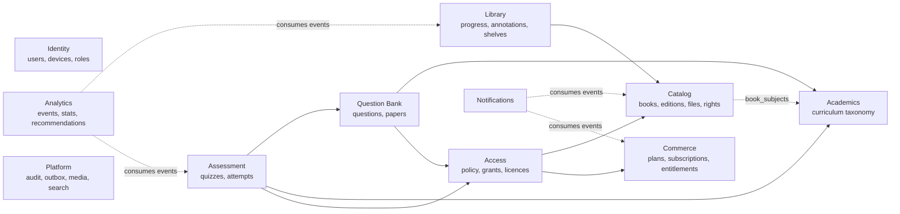
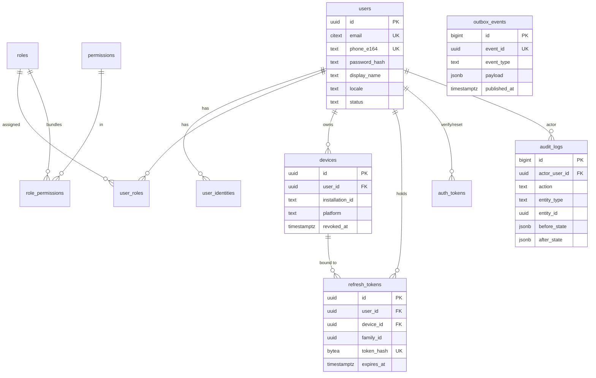
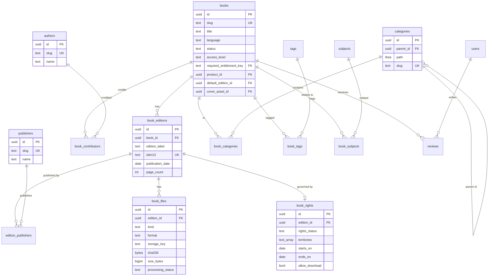
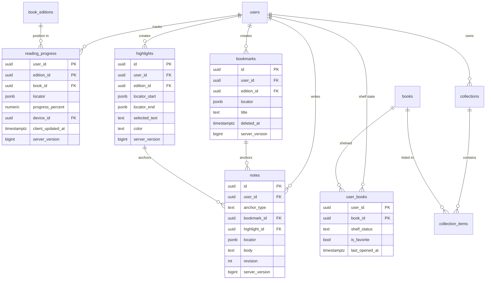
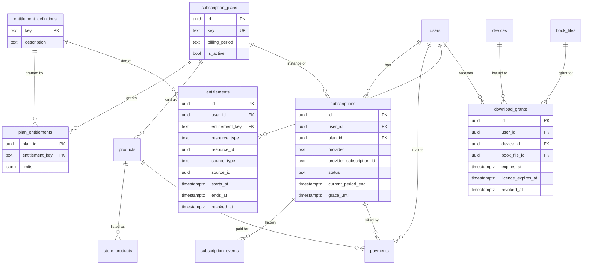
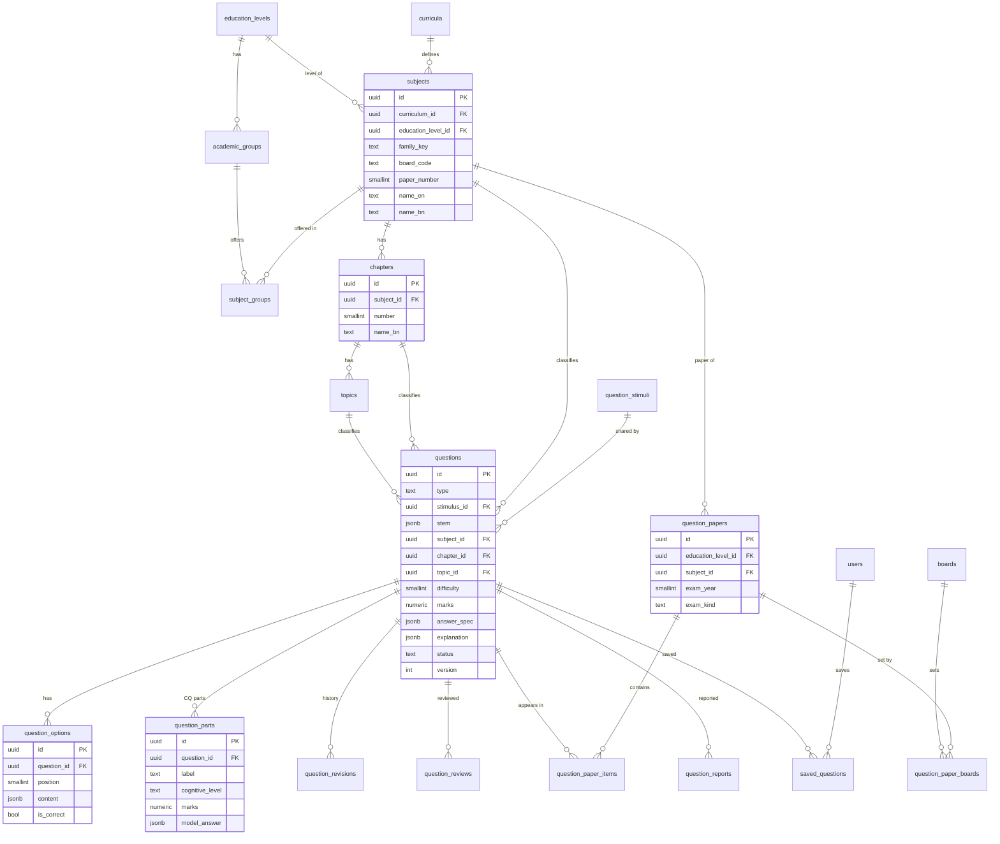
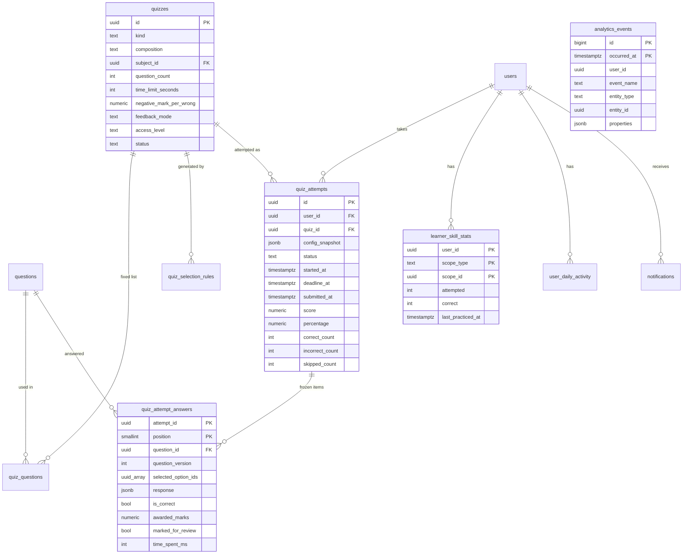

# 02 — Domain Model and ERD

Covers deliverable **B** (ERD) and the domain model. Column-level definitions are in [03-database-schema](03-database-schema.md).

---

## 1. Bounded contexts

Arrows mean "depends on". Every context references `users.id`; Identity and Platform are omitted from the arrows for clarity. The **Access** context is the single place that answers "may this user do X with resource Y?" for books, question collections and quizzes alike.

## 2. Ubiquitous language

> **Revised 2026-10-01:** Adds ExamPaper / ExamSession / ExamAnswer, Provenance record, Content source, Instruction medium, Entitlement event, Translation (§4–§8). See [12-phase0-revisions](12-phase0-revisions.md).

| Term | Meaning | Not to be confused with |
|------|---------|-------------------------|
| **Book** | The abstract work ("Clean Code"): title, description, categories, access policy | Edition |
| **Edition** | A specific published version (2nd ed., 2021, ISBN): publisher(s), page count, rights | File |
| **Book file** | A concrete binary for an edition: kind `full` or `preview`, format `epub` or `pdf` | Media asset (images) |
| **Locator** | A format-aware position in a book. EPUB: href + progression + fragment/CFI; PDF: page + offset. JSON with a `format` discriminator | "Page number" |
| **Shelf state** | The user's relationship to a book: want to read / reading / finished, favourite, last opened | Collection |
| **Collection** | A user-named list of books ("Exam Preparation") | Category |
| **Access level** | What a resource requires: `free`, `registered`, `entitled` | Entitlement |
| **Entitlement** | A time-bounded right held by a user, either to a **feature key** (`books.premium`) or to a **specific resource** (book X). Granted by a subscription, purchase, promotion or admin | Subscription |
| **Plan** | A sellable bundle of entitlement keys + limits ("Premium Annual") | Product |
| **Product** | Our internal SKU: a plan or a single book | Store product |
| **Store product** | The provider-side id of a product (Play product id + base plan; App Store product id) | — |
| **Subscription** | Our record of a provider subscription and its lifecycle | Entitlement (derived from it) |
| **Download grant** | Permission for one device to download one file, with an expiry | Offline licence |
| **Offline licence** | Server-signed token allowing a device to open a downloaded file offline until a date | DRM |
| **Curriculum** | A versioned national syllabus (e.g. NCTB 2012, the revised curriculum) | — |
| **Subject** | A board-coded examinable unit within a curriculum and level, e.g. *Physics 1st Paper (174)*. Papers are separate subjects sharing a `family_key` | Category |
| **Stimulus (উদ্দীপক)** | Shared content (passage, scenario, diagram) referenced by a CQ or a group of MCQs | Stem |
| **Question** | An atomic gradable item (or a CQ with parts): stem, answer data, explanation, classification | Paper item |
| **Question part** | A sub-question of a CQ (ক, খ, গ, ঘ) with its own marks and model answer | Option |
| **Question paper** | A historical exam paper: level, year, board(s), subject, exam kind, ordered items | Quiz |
| **Quiz** | A configured assessment (fixed list or rules), with time limit, scoring and access | Attempt |
| **Attempt** | One user's sitting of a quiz, with a **frozen** question set and a server deadline | — |
| **Learner skill stat** | Aggregated accuracy per user at subject / chapter / topic scope | Analytics event |

## 3. Aggregates and invariants

An aggregate is a consistency boundary. One transaction modifies one aggregate, plus its outbox and audit rows.

| Aggregate (root) | Contains | Invariants |
|------------------|----------|------------|
| **User** | identities, roles, devices, refresh tokens | ≥ 1 login method; email and phone unique among live users; a revoked device has no valid refresh tokens |
| **Book** | editions, contributors, categories, tags, subject links | Published ⇒ ≥ 1 published edition with a ready `full` file and acceptable rights; `entitled` ⇒ entitlement key or product set; exactly one primary category |
| **Edition** | files, rights, publishers | ≤ 1 current file per (kind, format); the preview file is never the full file (different object and checksum) |
| **ReadingProgress** (user, edition) | — | 0 ≤ percent ≤ 100; locator format matches the file format |
| **Annotation** (bookmark / highlight / note) | — | Exactly one owner; note anchor fields match `anchor_type`; deletes are tombstones |
| **Collection** | items | Name unique per user, case-insensitive, among live collections |
| **Plan** | plan entitlements | `key` immutable once sold; price changes create new store products rather than editing old ones |
| **Subscription** | events | (provider, provider subscription id) unique; state changes only through provider-verified events or audited admin actions |
| **Entitlement** | — | Exactly one of (`entitlement_key`, resource) set; `ends_at > starts_at`; source always traceable |
| **Question** | options, parts, answer spec, revisions | Type-specific completeness (§11); chapter belongs to subject; topic belongs to chapter; approver ≠ author |
| **QuestionPaper** | items, boards | Unique per (level, year, subject, exam kind, board set); item numbers unique |
| **Quiz** | fixed questions or selection rules | Fixed lists reference only published questions; rule pools must satisfy `question_count` at publish time |
| **QuizAttempt** | answer rows | Question set frozen at start; no answer accepted after `deadline_at` + grace; scored exactly once; ≤ 1 in-progress attempt per user per quiz |

## 4. ERD — Identity and Platform

## 5. ERD — Catalog

## 6. ERD — Library (user reading data)

## 7. ERD — Commerce and Access

## 8. ERD — Academics and Question Bank

## 9. ERD — Assessment, Analytics, Notifications

## 10. Cross-domain links (book + education unification)

| Link | Table | Used for |
|------|-------|----------|
| Book ↔ Subject | `book_subjects (book_id, subject_id)` | "Related SSC Mathematics questions / quizzes" on a book page; "Books for this chapter" on a weak-chapter recommendation |
| Category ↔ Subject family | `category_subject_families (category_id, family_key)` | Programming category → programming quizzes |
| Quiz ↔ Subject / Chapter | columns on `quizzes` + selection rules | Related quizzes |

Learning content outside SSC/HSC (e.g. Python quizzes) uses the **same** academics tables under curriculum `general` with education level `general`. No second taxonomy.

## 11. Type-specific question completeness rules

Enforced in the service layer, partly backed by DB constraints, and reused by the importer:

| Type | Required |
|------|----------|
| `mcq_single` | stem; 2–6 options; exactly 1 correct |
| `mcq_multi` | stem; 2–8 options; ≥ 1 correct |
| `true_false` | stem; exactly 2 options; exactly 1 correct |
| `fill_blank` | stem with ≥ 1 blank token; non-empty `answer_spec.blanks[i].accepted[]` for each blank |
| `matching` | `answer_spec.left[]`, `answer_spec.right[]`, `answer_spec.pairs[]` covering every left item |
| `short_answer` | stem; `model_answer`; `marks` |
| `creative` (CQ) | stimulus (via `stimulus_id`); ≥ 1 part; unique part labels; Σ part marks = question marks |

Previous-year questions (linked through `question_paper_items`) also need year, board(s), subject and source attribution on the paper.
