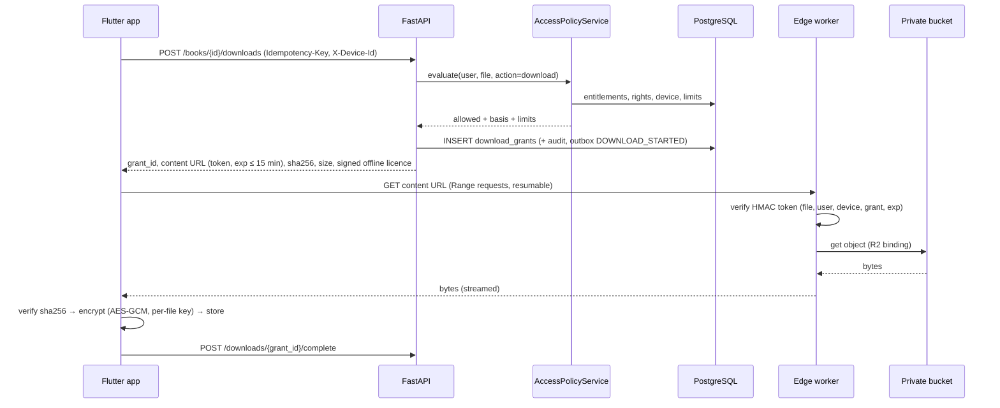

# 06 — Reader and Offline Sync

Covers deliverables **G** (reader architecture) and **K** (offline sync architecture), plus secure book access and downloads.

---

## 1. Goals

- Reading must not depend on the network once a book is downloaded.
- Annotations created on any device appear on every device, and **no user data is silently lost**.
- The rendering engine can be swapped (for a stronger native or DRM engine) without touching library, sync, annotation or UI code.

## 2. Reader engine abstraction

```text
features/reader/
├── domain/
│   ├── locator.dart            # Locator sealed class (EpubLocator | PdfLocator) + JSON codec
│   ├── reader_engine.dart      # abstract interface (below)
│   └── reader_session.dart     # state: position, selection, toc, settings
├── engines/
│   ├── epub_engine_*.dart      # adapter over the chosen EPUB implementation
│   └── pdf_engine_pdfrx.dart   # adapter over pdfrx (PDFium)
└── presentation/               # reader screen, controls, sheets — engine-agnostic
```

```dart
abstract interface class ReaderEngine {
  Future<ReaderDocument> open(LocalBookSource source, {Locator? initial});
  Stream<Locator> get positionChanges;          // debounced by the session
  Stream<TextSelection> get selections;         // for highlight / note
  Future<void> goTo(Locator locator);
  Future<List<TocEntry>> tableOfContents();
  Stream<SearchHit> search(String query);
  Future<void> applySettings(ReaderSettings s); // font, size, spacing, theme, margins
  Future<void> renderHighlights(List<HighlightRange> ranges);
  Future<void> close();
}
```

`LocalBookSource` hands the engine **decrypted bytes through a stream or in-memory file handle**, never a plaintext file on disk (§5).

### Engine choice

| Format | Candidate | Assessment |
|--------|-----------|-----------|
| PDF | **pdfrx** (PDFium, all platforms, text selection, search) | Default choice; verify current version and API at Phase 3 start |
| EPUB | (a) Readium Kotlin/Swift toolkits via a Flutter plugin (e.g. `flutter_readium`) | Best fidelity, accessibility, Locator model, LCP DRM path. Platform-channel work; verify plugin maturity |
| EPUB | (b) WebView + a JS engine (foliate-js / epub.js) | Cross-platform, good CSS support, highlights via CFI; WebView memory and gesture tuning needed |
| EPUB | (c) Pure-Dart EPUB renderer | Weakest typography for complex Bangla shaping; not recommended |

**Decision rule:** Phase 3 begins with a **one-week spike**. Render the same five test books (complex Bangla conjuncts, math images, tables, long chapters, a fixed-layout EPUB) in (a) and (b), then measure page-turn latency, memory, selection accuracy, Bangla shaping, TalkBack support and highlight stability. Choose by the measured result. The adapter keeps the alternative replaceable. Our `Locator` model follows the **Readium Locator** shape regardless, so annotations survive an engine change.

## 3. Secure access and download flow



Online reading without downloading uses the same flow with `POST /books/{id}/access` (`purpose=read` or `preview`). The app streams into its encrypted cache, which is evicted by LRU (default cap 500 MB).

**Token expiry versus long downloads:** the edge validates the token once, at request start. Resumed range requests after expiry call `POST /books/{id}/downloads` again with the **same idempotency key**, which returns the same grant with a fresh URL.

## 4. Locator model

Stored as JSONB with a format discriminator. Modelled on the Readium Locator so it maps directly onto Readium-based engines.

```json
{
  "format": "epub",
  "href": "OEBPS/chapter05.xhtml",
  "media_type": "application/xhtml+xml",
  "title": "Chapter 5: Normalization",
  "locations": {
    "progression": 0.42,
    "total_progression": 0.62,
    "position": 214,
    "fragments": ["epubcfi(/6/14!/4/2/10:15)"]
  },
  "text": { "before": "…the second normal form ", "highlight": "requires", "after": " that every…" }
}
```

```json
{ "format": "pdf", "page": 118, "page_count": 342, "offset_y": 0.35, "total_progression": 0.345 }
```

Rules:

- `total_progression` is always present, so progress percent and cross-format display work.
- `text.before/highlight/after` is stored for highlights. If an edition's file is replaced (typo fix), the app **re-anchors** highlights by text match when the CFI no longer resolves; failures are listed under "Highlights that need attention" rather than dropped.
- Locators reference an **edition** and **file format**. Moving between the EPUB and PDF of one edition maps by `total_progression` (approximate, flagged in UI).

## 5. Local storage (Drift / SQLite)

Only what offline use requires:

| Local table | Purpose |
|-------------|---------|
| `downloaded_books` | file id, edition, format, size, sha256, encrypted path, wrapped file key, licence (signed token + expiry), last opened |
| `book_meta_cache` | title, authors, cover URL/cached path, TOC, access snapshot — enough to render the library offline |
| `reading_progress` | mirror of server rows + `dirty` flag |
| `bookmarks`, `highlights`, `notes` | mirror rows incl. tombstones, `server_version`, `dirty` |
| `user_books`, `collections`, `collection_items` | shelf state and collections |
| `saved_questions` | ids + cached question payloads for offline review |
| `quiz_drafts` | in-progress attempt answers waiting to be sent (06 §8) |
| `outbox_ops` | pending sync operations (§6) |
| `sync_state` | pull cursor, last sync time, last error |

The SQLite database is encrypted at rest (SQLCipher via the Drift setup, with the key in secure storage) because it holds notes and reading history of minors.

**Book file encryption:** a random 256-bit file key per download. File chunks are AES-256-GCM encrypted in 1 MB segments, each with its own nonce, so random access and PDF page seeking work without decrypting everything. The file key is wrapped with a device key from Android Keystore / iOS Keychain. On logout or device revocation, keys and files are deleted.

## 6. Synchronisation engine

### 6.1 Model

- **Client-generated ids** (UUIDv7) for every user-created row, so creating the same bookmark twice is a no-op upsert.
- **Operation outbox:** every local mutation writes the row and appends an `outbox_ops` entry `{op_id, entity, action, payload, created_at, attempts}` in **one local transaction**.
- **Push:** the sync worker sends the oldest ≤ 200 ops per request with an `Idempotency-Key`. The server applies each op in its own savepoint and returns per-op results. Applied or duplicate ops are removed; conflicts are resolved (§6.3); rejected ops (e.g. a book no longer exists) are dropped with a user-visible notice when relevant.
- **Pull:** `GET /sync/pull?cursor=` returns rows with `server_version > cursor` across all synced tables (tombstones included), ordered by `server_version`, paged. The client applies them (skipping rows with a newer local dirty change, which push will reconcile) and stores the new cursor only after a page is committed locally.
- **Order per cycle:** push → pull → push the remainder. Triggers: app start, foreground, connectivity regained, after local changes (debounced 5 s), periodic background (WorkManager / BGTaskScheduler, ≥ 15 min, OS-permitting), pull-to-refresh.
- **Server ordering guarantee:** per-user advisory lock + global sequence ([03 §5](03-database-schema.md#5-library-synced-user-data)), so a cursor never skips rows.

### 6.2 Failure handling

| Situation | Behaviour |
|-----------|-----------|
| No network | Ops accumulate; UI shows a quiet "Saved on this device" state, never an error |
| Timeout / 5xx / 503 | Exponential backoff with jitter (2 s → 5 min cap); the same idempotency key is reused for the same batch |
| Duplicate delivery | Server idempotency key ⇒ stored response; per-op `op_id` dedupe ⇒ `duplicate` |
| 401 expired access | Refresh once, then retry |
| Refresh fails (session revoked) | Keep local data, stop syncing, ask the user to sign in. After re-login **as the same user**, sync resumes. A different user ⇒ the previous user's local data is wiped (shared-device safety) after warning that unsynced changes will be lost; the offer to sign back in first comes before the wipe |
| Partial batch | Per-op results; the batch never fails as a whole |
| App killed mid-sync | Outbox is durable; cursor advances only after local commit, so re-pulling is safe (idempotent apply) |
| Very old offline client | If the cursor is older than retained tombstones (90 days), the server answers `410 RESYNC_REQUIRED` and the client does a full snapshot pull, then re-pushes local dirty rows |

### 6.3 Conflict resolution (per entity, not blanket overwrite)

| Entity | Strategy | Reasoning |
|--------|----------|-----------|
| Reading progress | **Most recent reading activity wins**, judged by `client_updated_at` with a server sanity clamp (a timestamp in the future is clamped to the receive time). When two devices are within 2 minutes but far apart in position, the app shows "Continue from Chapter 9 (Tablet) or stay at Chapter 5?" | Matches user intent ("where I last read"); max-progress would break re-reading |
| Bookmark / highlight create | Union (distinct ids ⇒ both kept) | Additive data never conflicts |
| Bookmark / highlight edit (title, colour) | Last-writer-wins per field by server receipt order | Low-value fields |
| Delete vs. edit | Delete wins (tombstone); an edit arriving after a delete is ignored and returned as `conflict` with the tombstone | Users expect deletes to stick |
| Note body edit | **Optimistic concurrency on `revision`.** If `base_revision` ≠ server revision, the server keeps the server version and returns `conflict` with it. The client then creates a **conflict copy** ("Note (edited on Phone)") anchored to the same place and flags it. **Neither text is lost** | Notes are user-authored text; silent overwrite is unacceptable |
| Shelf state | Field-wise LWW; `finished` is never downgraded automatically by progress | |
| Collections | Name edit LWW; item add/remove as a set with tombstones | |
| Saved questions | Set semantics with tombstones | |

## 7. DRM seam

- `book_files.protection_scheme` (`none` today; `lcp` later) tells the app which engine path to use.
- `ReaderEngine` adapters are selected by `(format, protection_scheme)`. A Readium LCP-capable adapter can be added without changing library, sync or annotation code.
- The access API already returns a per-file grant and licence. An LCP licence document would be returned by the same endpoint (`licence.type = "lcp"`) from an LCP licence server integrated in `access`.
- Our own encryption-at-rest is labelled internally and in documentation as **storage protection**, never as DRM.

## 8. Offline quizzes and exams

- **Practice mode:** works offline for downloaded "practice packs" (saved questions, chapter packs the user downloads). Answers are checked locally against answer keys **only in packs the user is entitled to with answers visible**. Results sync later as `practice_session` analytics and update learner stats.
- **Timed exams (mock exams):** require a connection **to start and to submit**. Once started, answers are stored locally as well and sent per answer. A connection drop mid-exam keeps the local timer running from the server `deadline_at` (corrected by the measured server-clock offset) and queues answers. On reconnect, queued answers with `answered_at` before the deadline are accepted within the grace window (§ [08](08-question-bank-and-assessment.md#8-timer-and-integrity)). After the deadline, the server auto-submits whatever it received.

## 9. Reader UX notes (implementation detail in 09)

- Immersive mode: controls hide after 3 s of reading; a tap in the centre toggles them.
- Settings bottom sheet: font family (Noto Serif Bengali / Noto Sans Bengali / Noto Serif / system), size (12–32 sp), line height, margins, reading theme (light, sepia, dark, independent of the app theme), brightness, page vs. scroll mode (EPUB), keep screen on.
- Progress footer: chapter title, percent, "x min left in chapter" (estimated from words and the user's own measured reading speed).
- Text selection menu: highlight (5 colours, each with a distinct name for screen readers), add note, copy (subject to rights), search, define (later).

## 10. Testing

| Level | Cases |
|-------|-------|
| Unit (Dart) | Locator codec round-trips; conflict rules table; outbox ordering; backoff; re-anchoring by text context |
| Unit (Python) | Per-op apply semantics; tombstones; revision conflicts; cursor paging; advisory-lock ordering (concurrent transactions test) |
| Integration | Two simulated devices: offline edits on both → sync → expected merged state for every entity, including delete-vs-edit and note conflicts |
| Chaos | Random network drops, duplicate deliveries, app kills mid-batch; invariant: server state == union of intended ops, no duplicates, no loss |
| Reader | Golden screenshots of Bangla rendering in each theme; page-turn performance budget in CI on a profile build; highlight stability after file replacement |
| Security | Expired/forged tokens rejected at the edge; revoked device cannot renew licences; local files are unreadable without the device key |
